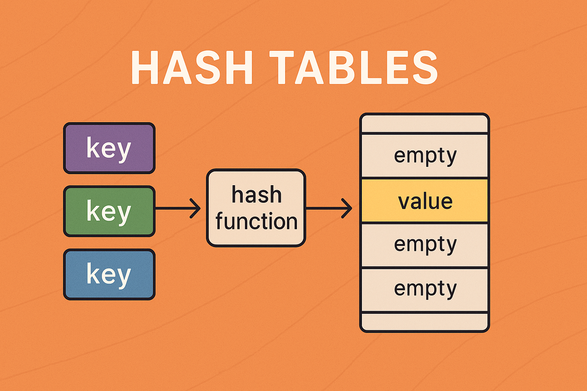
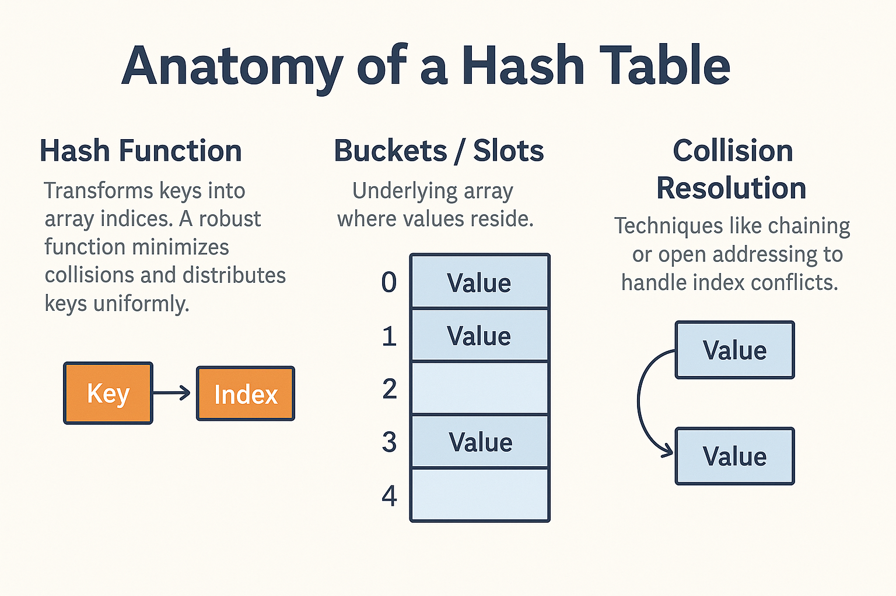

export const metadata = {
  "postId": "5c9d8e7f-3a2b-4e5c-9f1d-8a7b6c5d4e3f",
  "title": "Understanding Hash Tables: The Ultimate Guide",
  "date": "2024-01-15",
  "excerpt": "A comprehensive guide to hash tables, covering implementation details, collision resolution strategies, and performance analysis with practical examples.",
  "author": "Abstract Algorithms",
  "tags": [
    "data-structures",
    "algorithms",
    "hash-tables",
    "performance"
  ],
  "coverImage": "./assets/overview.png"
};


# Understanding Hash Tables: The Ultimate Guide

Hash tables are one of the most fundamental and powerful data structures in computer science, offering average-case O(1) time complexity for basic operations. This comprehensive guide explores hash tables from the ground up.

## What Are Hash Tables?

A hash table (also known as a hash map) is a data structure that implements an associative array abstract data type, mapping keys to values. It uses a hash function to compute an index into an array of buckets or slots.



### Key Components

1. **Hash Function**: Converts keys into array indices
2. **Buckets**: Array slots that store key-value pairs
3. **Collision Resolution**: Strategy for handling multiple keys mapping to the same index



## Hash Functions

A good hash function should:
- Be deterministic
- Distribute keys uniformly
- Be fast to compute
- Minimize collisions

### Common Hash Functions

#### Division Method
```javascript
function hashDivision(key, tableSize) {
  return key % tableSize;
}
```

#### Multiplication Method
```javascript
function hashMultiplication(key, tableSize) {
  const A = 0.6180339887; // (sqrt(5) - 1) / 2
  return Math.floor(tableSize * ((key * A) % 1));
}
```

## Collision Resolution

When two keys hash to the same index, we need collision resolution strategies:

### 1. Chaining (Separate Chaining)

Each bucket contains a linked list of entries:


```javascript
class HashTableChaining {
  constructor(size = 53) {
    this.keyMap = new Array(size);
  }
  
  hash(key) {
    let total = 0;
    let WEIRD_PRIME = 31;
    for (let i = 0; i < Math.min(key.length, 100); i++) {
      let char = key[i];
      let value = char.charCodeAt(0) - 96;
      total = (total * WEIRD_PRIME + value) % this.keyMap.length;
    }
    return total;
  }
  
  set(key, value) {
    let index = this.hash(key);
    if (!this.keyMap[index]) {
      this.keyMap[index] = [];
    }
    this.keyMap[index].push([key, value]);
  }
  
  get(key) {
    let index = this.hash(key);
    if (this.keyMap[index]) {
      for (let i = 0; i < this.keyMap[index].length; i++) {
        if (this.keyMap[index][i][0] === key) {
          return this.keyMap[index][i][1];
        }
      }
    }
    return undefined;
  }
}
```

### 2. Open Addressing

All entries are stored directly in the hash table array:

#### Linear Probing
```javascript
class HashTableLinearProbing {
  constructor(size = 53) {
    this.keyMap = new Array(size);
    this.values = new Array(size);
  }
  
  hash(key) {
    let total = 0;
    let WEIRD_PRIME = 31;
    for (let i = 0; i < Math.min(key.length, 100); i++) {
      let char = key[i];
      let value = char.charCodeAt(0) - 96;
      total = (total * WEIRD_PRIME + value) % this.keyMap.length;
    }
    return total;
  }
  
  set(key, value) {
    let index = this.hash(key);
    while (this.keyMap[index] !== undefined) {
      if (this.keyMap[index] === key) {
        this.values[index] = value;
        return;
      }
      index = (index + 1) % this.keyMap.length;
    }
    this.keyMap[index] = key;
    this.values[index] = value;
  }
  
  get(key) {
    let index = this.hash(key);
    while (this.keyMap[index] !== undefined) {
      if (this.keyMap[index] === key) {
        return this.values[index];
      }
      index = (index + 1) % this.keyMap.length;
    }
    return undefined;
  }
}
```

## Performance Analysis

### Time Complexity

| Operation | Average Case | Worst Case |
|-----------|--------------|------------|
| Insert    | O(1)         | O(n)       |
| Delete    | O(1)         | O(n)       |
| Search    | O(1)         | O(n)       |

### Space Complexity

O(n) where n is the number of key-value pairs.

### Load Factor

The load factor α = n/m where:
- n = number of stored elements
- m = number of buckets

Optimal load factors:
- **Chaining**: α ≤ 1
- **Open Addressing**: α ≤ 0.7

## Advanced Topics

### Dynamic Resizing

When load factor exceeds threshold, resize the hash table:

```javascript
resize() {
  let oldKeyMap = this.keyMap;
  let oldValues = this.values;
  
  this.keyMap = new Array(oldKeyMap.length * 2);
  this.values = new Array(oldValues.length * 2);
  
  for (let i = 0; i < oldKeyMap.length; i++) {
    if (oldKeyMap[i] !== undefined) {
      this.set(oldKeyMap[i], oldValues[i]);
    }
  }
}
```

### Consistent Hashing

Used in distributed systems to minimize rehashing when nodes are added/removed.

## Real-World Applications

1. **Database Indexing**: Fast record lookup
2. **Caching**: Web browsers, CDNs
3. **Symbol Tables**: Compilers and interpreters
4. **Sets**: Unique element storage
5. **Routing Tables**: Network packet routing

## Best Practices

1. **Choose appropriate hash function** for your key type
2. **Monitor load factor** and resize when necessary
3. **Handle collisions efficiently** based on usage patterns
4. **Consider memory vs. time tradeoffs**
5. **Use prime numbers** for table sizes to reduce clustering

## Common Pitfalls

1. **Poor hash function** leading to clustering
2. **Ignoring load factor** causing performance degradation
3. **Not handling edge cases** like null keys
4. **Memory leaks** in chaining implementations

## Conclusion

Hash tables are essential for building efficient software systems. Understanding their internals helps you:

- Choose the right implementation for your use case
- Debug performance issues
- Design better algorithms
- Optimize memory usage

The key to effective hash table usage is balancing simplicity, performance, and memory consumption based on your specific requirements.

## Further Reading

- [Introduction to Algorithms by Cormen et al.](https://example.com)
- [Hash Table Visualization](https://example.com)
- [Performance Analysis of Hash Functions](https://example.com)
- [Distributed Hash Tables](https://example.com)

