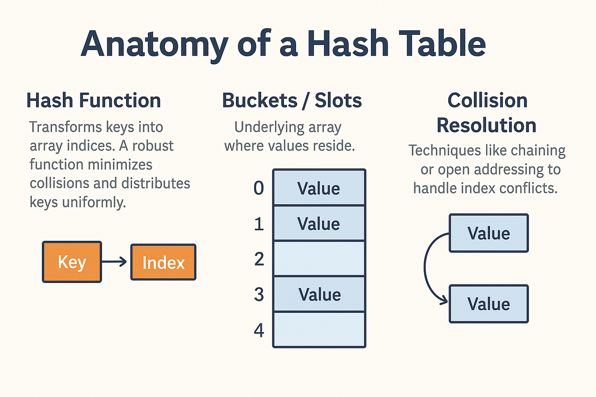
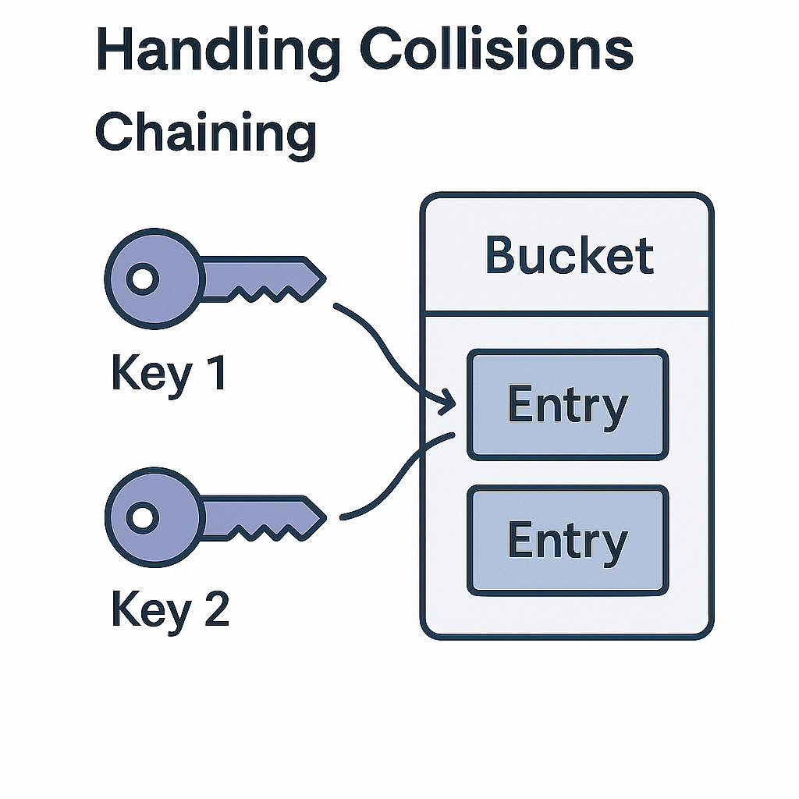

# Hash Tables: The Ultimate Guide


Hash tables (also known as hash maps or dictionaries) are fundamental data structures that provide extremely fast access to data by mapping keys to values. They are widely used in software engineering due to their average-case constant time complexity for search, insert, and delete operations.

## Why Use Hash Tables?

Hash tables are ideal for scenarios where you need to:
- Quickly look up values by a unique key (e.g., username → user profile)
- Count occurrences of items (e.g., word frequency in a document)
- Implement sets, caches, or associative arrays
- Index data for fast retrieval (e.g., database indexes, symbol tables in compilers)

**Example Applications:**
- Caching web pages or database queries
- Implementing sets/maps in programming languages (e.g., Python's `dict`, JavaScript's `Object`/`Map`)
- Counting unique visitors or items
- Storing configuration or environment variables

## Anatomy of a Hash Table

1. **Hash Function**: Transforms keys into array indices. A robust function minimizes collisions and distributes keys uniformly.
2. **Buckets / Slots**: Underlying array where values reside.
3. **Collision Resolution**: Techniques like chaining or open addressing to handle index conflicts.



## How Hash Functions Work

A hash function takes an input (the key) and returns an integer (the hash code), which is then mapped to an index in the underlying array. Good hash functions:
- Are deterministic (same input always gives same output)
- Distribute keys uniformly to minimize clustering
- Are fast to compute

### Example: Simple Modulo Hash

```javascript
function simpleHash(key, tableSize) {
  let hash = 0;
  for (let char of key) {
    hash = (hash * 31 + char.charCodeAt(0)) % tableSize;
  }
  return hash;
}
```

> The choice of multiplier (e.g., 31) affects distribution; primes often yield better spreads.

### Real-World Hash Functions
- **MurmurHash, CityHash, FNV-1a**: Used in production systems for better distribution and speed.
- **Cryptographic hashes (SHA-256, MD5)**: Used for security, not for hash tables (too slow).

## Handling Collisions

When two keys hash to the same index, a collision occurs. There are two main strategies:

### Chaining

Each bucket holds a list of entries. Collisions are handled by appending to the list.



```javascript
class HashTableChain {
  constructor(size = 42) {
    this.buckets = Array.from({ length: size }, () => []);
  }

  insert(key, value) {
    const index = simpleHash(key, this.buckets.length);
    this.buckets[index].push([key, value]);
  }

  // ...existing code...
}
```

### Open Addressing (Linear Probing)

All entries are stored in the array itself. On collision, the algorithm searches for the next available slot.


```javascript
class HashTableProbing {
  constructor(size = 42) {
    this.table = new Array(size).fill(null);
  }

  // ...existing code...
}
```

## Example Scenario: Username Lookup

Suppose you want to check if a username is taken:
1. Hash the username to get an index.
2. Check the bucket (or slot) at that index.
3. If found, the username is taken; otherwise, it's available.

This operation is extremely fast, even with thousands or millions of users.

## Performance Analysis

| Operation    | Average Case | Worst Case | Explanation |
|--------------|--------------|------------|-------------|
| Search       | O(1)         | O(n)       | Constant time if well-distributed; O(n) if all keys collide |
| Insert       | O(1)         | O(n)       | Usually constant, but can degrade with many collisions |
| Delete       | O(1)         | O(n)       | Same as above |

- **Average Case**: With a good hash function and low load factor, operations are nearly instantaneous.
- **Worst Case**: If many keys collide (poor hash function or overloaded table), performance degrades to linear time.

## Conclusion

Well-implemented hash tables power applications that require rapid lookups, from caching layers to in-memory databases. Selecting the right collision strategy and hash function is key to maintaining high performance.
