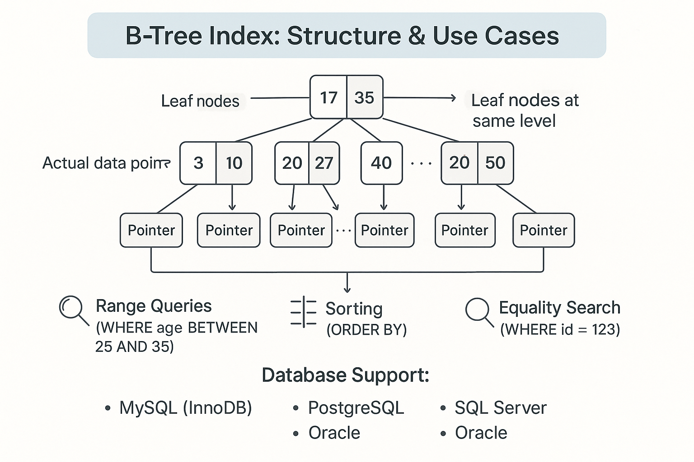

## What is a Database Index?
A database index is a data structure that improves the speed of data retrieval operations on a database table at the cost of additional space and maintenance overhead. Think of it like an index in a book: it helps you find information quickly without scanning every page.

```sql
-- Without index: Full table scan O(n)
SELECT * FROM users WHERE email = 'john@example.com';

-- With index on email: Tree traversal O(log n)
CREATE INDEX idx_users_email ON users(email);
SELECT * FROM users WHERE email = 'john@example.com';
```

## How Indexes Work Internally
### The Problem: Linear Search
Without indexes, databases perform **full table scans**:
- Read every row sequentially
- Check if the row matches the condition
- Time complexity: O(n) where n is the number of rows

### The Solution: Tree Structures
Indexes create **sorted tree structures**:
- Maintain sorted order of key values
- Use binary search principles
- Time complexity: O(log n) for lookups

## Core Index Types

### 1. B-Tree Indexes (Most Common)
**Structure:**
- Balanced tree with multiple keys per node
- Leaf nodes contain actual data pointers
- All leaf nodes are at the same level

**Best For:**
- Range queries (`WHERE age BETWEEN 25 AND 35`)
- Sorting operations (`ORDER BY`)
- Equality searches (`WHERE id = 123`)

**Database Support:**
- MySQL (InnoDB): Primary index type
- PostgreSQL: Default for most data types
- SQL Server: Clustered and non-clustered indexes
- Oracle: Standard B-Tree indexes



```sql
-- B-Tree index example
CREATE INDEX idx_users_age ON users(age);

-- Efficient queries:
SELECT * FROM users WHERE age = 30;          -- Equality
SELECT * FROM users WHERE age > 25;          -- Range
SELECT * FROM users WHERE age BETWEEN 20 AND 40; -- Range
SELECT * FROM users ORDER BY age;            -- Sorting
```

### 2. Hash Indexes
**Structure:**
- Uses hash function to map keys to buckets
- Direct access to data location
- No ordering maintained

**Best For:**
- Exact equality searches only
- High-frequency lookups
- Memory-based operations

**Limitations:**
- No range queries
- No sorting support
- Hash collisions can degrade performance

```sql
-- Hash index (MySQL Memory engine)
CREATE TABLE user_sessions (
    session_id VARCHAR(64) PRIMARY KEY,
    user_id INT,
    data TEXT
) ENGINE=MEMORY;

-- Perfect for:
SELECT * FROM user_sessions WHERE session_id = 'abc123def456';
-- NOT suitable for:
SELECT * FROM user_sessions WHERE session_id LIKE 'abc%';
```

### 3. Bitmap Indexes
**Structure:**
- Uses bitmaps (bit vectors) for each distinct value
- Each bit represents whether a row contains the value
- Highly compressed for low-cardinality data

**Best For:**
- Data warehousing
- Columns with few distinct values (gender, status, category)
- Complex analytical queries with multiple conditions

**Database Support:**
- Oracle: Full bitmap index support
- PostgreSQL: Partial support via extensions
- Not available in MySQL or SQL Server

```sql
-- Bitmap index example (Oracle)
CREATE BITMAP INDEX idx_employee_gender ON employees(gender);
CREATE BITMAP INDEX idx_employee_status ON employees(status);

-- Efficient for analytical queries:
SELECT COUNT(*) 
FROM employees 
WHERE gender = 'F' 
  AND status = 'ACTIVE' 
  AND department = 'ENGINEERING';
```

### 4. Specialized Index Types

#### Full-Text Indexes
For searching within text content:
```sql
-- MySQL Full-Text Index
CREATE FULLTEXT INDEX idx_articles_content ON articles(title, content);
SELECT * FROM articles WHERE MATCH(title, content) AGAINST('database optimization');

-- PostgreSQL GIN Index for text search
CREATE INDEX idx_articles_content ON articles USING gin(to_tsvector('english', content));
SELECT * FROM articles WHERE to_tsvector('english', content) @@ to_tsquery('database & optimization');
```

#### Spatial Indexes
For geographic and geometric data:
```sql
-- PostGIS Spatial Index
CREATE INDEX idx_locations_geom ON locations USING gist(geom);
SELECT * FROM locations WHERE ST_DWithin(geom, ST_Point(-122.4194, 37.7749), 1000);
```

## Index Storage and Structure

### Clustered vs Non-Clustered Indexes

#### Clustered Index
- **Physical ordering**: Data rows are stored in the same order as the index
- **One per table**: Only one clustered index possible
- **Direct data access**: Index leaf nodes contain actual data rows

```sql
-- SQL Server clustered index
CREATE CLUSTERED INDEX idx_orders_date ON orders(order_date);
-- Data rows are physically ordered by order_date
```

#### Non-Clustered Index
- **Logical ordering**: Index is separate from data storage
- **Multiple allowed**: Can have many non-clustered indexes
- **Pointer to data**: Index points to the actual data location

```sql
-- Non-clustered index
CREATE NONCLUSTERED INDEX idx_customers_email ON customers(email);
-- Index structure points to data rows
```

### Index Pages and Storage
```
B-Tree Structure:
                [Root Page]
               /           \
         [Internal Page]  [Internal Page]
         /      |     \   /      |      \
    [Leaf]  [Leaf]  [Leaf] [Leaf] [Leaf] [Leaf]
      |       |       |     |       |      |
   [Data]  [Data]  [Data] [Data]  [Data] [Data]
```

## Performance Characteristics

### Index Benefits
- **Faster SELECT queries**: O(log n) vs O(n)
- **Efficient sorting**: ORDER BY uses index order
- **Quick joins**: JOIN operations use indexes
- **Unique constraints**: Prevent duplicate values

### Index Costs
- **Storage overhead**: Additional disk space (20-30% typical)
- **Write performance**: INSERT/UPDATE/DELETE slower
- **Maintenance overhead**: Index must be updated with data changes
- **Memory usage**: Indexes consume buffer pool memory

## When to Use Each Index Type

### Use B-Tree When:
- Range queries are common
- Sorting is frequently needed
- General-purpose OLTP applications
- High selectivity columns

### Use Hash When:
- Only equality searches needed
- High-frequency exact lookups
- Memory-based tables
- Session or cache tables

### Use Bitmap When:
- Data warehousing scenarios
- Low-cardinality columns
- Complex analytical queries
- Read-heavy workloads

## Next in This Series
In the upcoming parts, we'll dive deeper into:
- **Part 2**: SQL Database Indexing Strategies (MySQL, PostgreSQL, SQL Server)
- **Part 3**: NoSQL Database Indexing (MongoDB, Cassandra, Redis)
- **Part 4**: Composite Indexes and Query Optimization
- **Part 5**: Index Performance Monitoring and Maintenance
- **Part 6**: Advanced Indexing Techniques and Partitioning
- **Part 7**: Client-Side Optimization and Caching Strategies
- **Part 8**: Real-World Case Studies and Best Practices
- **Query Patterns:** Design indexes based on how data is accessed (e.g., filter, sort, join columns).
- **Index Fragmentation:** Over time, indexes can become fragmented and less efficient; periodic maintenance may be needed.

## What Causes Bad Query Performance?
- **Missing Indexes:** Full table scans for every query.
- **Unselective Indexes:** Indexes on columns with many repeated values (low cardinality) are less useful.
- **Too Many Indexes:** Increases write cost and can confuse the query planner.
- **Outdated Statistics:** The database optimizer relies on statistics to choose indexes; stale stats can lead to poor plans.
- **Improper Query Design:** Functions or operations on indexed columns can prevent index usage.

---

*Indexes are a powerful tool for optimizing database performance. By understanding how they work and when to use them, you can significantly improve your application's data retrieval speed.*
