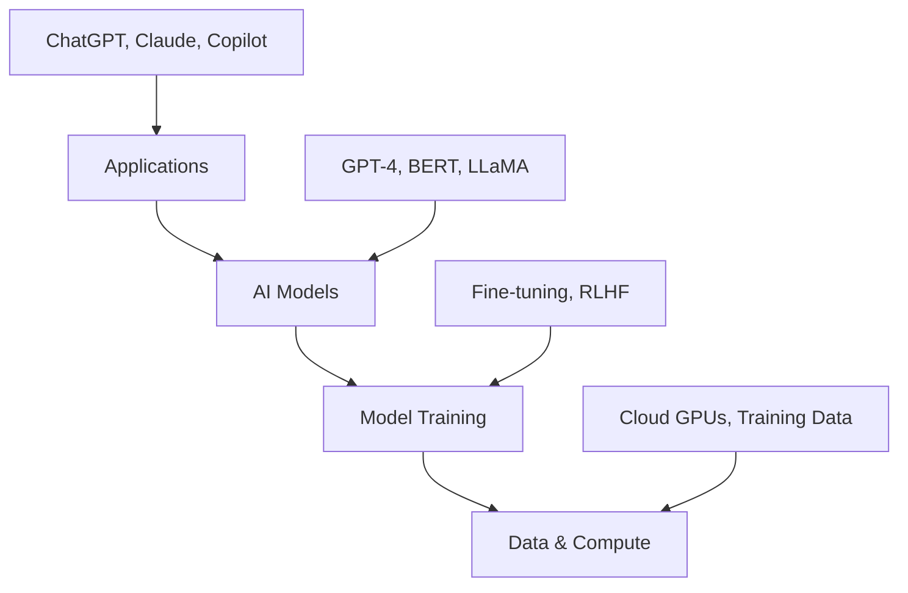

export const metadata = {
  title: "Introduction & AI Landscape Overview",
  date: "2024-12-01",
  excerpt: "Welcome to the GenAI Mastery series! Explore the current AI landscape, understand key concepts, and set the foundation for your journey into Generative AI technologies.",
  author: "Abstract Algorithms",
  tags: ["genai", "ai-landscape", "introduction", "ai-overview", "generative-ai", "ai-fundamentals"],
  coverImage: "./assets/part-1.png",
  series: {
    name: "GenAI Mastery",
    order: 1,
    total: 12,
    next: "/posts/genai-mastery-series/part-2"
  }
}

# Introduction & AI Landscape Overview

Welcome to the GenAI Mastery series! In this comprehensive introduction, we'll explore the current AI landscape, understand key concepts, and set the foundation for our deep dive into Generative AI technologies.

*Evolution of AI from symbolic systems to modern generative models*

## 🌟 The AI Revolution

We're living through one of the most transformative periods in human history. Generative AI has moved from research labs to everyday applications, fundamentally changing how we work, create, and solve problems.

### Key Milestones in AI History

- **1950s-1960s**: Symbolic AI and expert systems
- **1980s-1990s**: Machine learning algorithms emerge
- **2000s-2010s**: Deep learning breakthrough
- **2017**: Transformer architecture revolutionizes NLP
- **2022-2024**: Large Language Models go mainstream

## 🏗️ Understanding the AI Ecosystem

*The modern AI technology stack*

### Core AI Categories

1. **Traditional Machine Learning**
   - Supervised, unsupervised, reinforcement learning
   - Classic algorithms: Linear regression, SVMs, Random Forest

2. **Deep Learning**
   - Neural networks with multiple layers
   - CNNs for vision, RNNs for sequences

3. **Generative AI**
   - Models that create new content
   - Text, images, code, audio, video

### The GenAI Technology Stack

## 🎯 Key Players in the GenAI Space

### Major AI Companies

**OpenAI**
- GPT series (GPT-3.5, GPT-4, GPT-4 Turbo)
- DALL-E for image generation
- Whisper for speech recognition

**Google/Alphabet**
- Gemini (formerly Bard)
- PaLM and LaMDA models
- Vertex AI platform

**Anthropic**
- Claude series (Claude 3 Opus, Sonnet, Haiku)
- Constitutional AI approach
- Focus on AI safety

**Meta**
- LLaMA models (open source)
- Code Llama for programming
- Research in multimodal AI

**Microsoft**
- Copilot integration across products
- Azure OpenAI Service
- Partnership with OpenAI

## 🔧 GenAI Applications Across Industries

*GenAI transforming every industry*

### 💼 Business & Productivity
- **Content Creation**: Marketing copy, documentation
- **Customer Service**: AI chatbots and virtual assistants
- **Data Analysis**: Automated insights and reporting

### 💻 Software Development
- **Code Generation**: GitHub Copilot, Amazon CodeWhisperer
- **Testing**: Automated test case generation
- **Documentation**: API docs, code comments

### 🎨 Creative Industries
- **Visual Arts**: DALL-E, Midjourney, Stable Diffusion
- **Writing**: Content generation, editing assistance
- **Music**: AI composition and production tools

### 🏥 Healthcare
- **Drug Discovery**: Protein folding, molecular design
- **Medical Imaging**: Diagnostic assistance
- **Clinical Documentation**: Note generation, coding

### 🎓 Education
- **Personalized Learning**: Adaptive content delivery
- **Tutoring**: AI teaching assistants
- **Assessment**: Automated grading and feedback

## 🧠 Core Concepts You'll Master

### 1. **Foundation Models**
Large, general-purpose models trained on diverse data
- Pre-trained on massive datasets
- Can be fine-tuned for specific tasks
- Examples: GPT-4, Claude, LLaMA

### 2. **Emergent Abilities**
Capabilities that appear in large models but not smaller ones
- In-context learning
- Chain-of-thought reasoning
- Few-shot task performance

### 3. **Alignment & Safety**
Ensuring AI systems behave as intended
- Reducing harmful outputs
- Constitutional AI principles
- Human feedback integration

## 🛠️ Technical Prerequisites

To get the most from this series, you should have:

**Essential:**
- Basic programming knowledge (Python preferred)
- Understanding of machine learning concepts
- Familiarity with data structures and algorithms

**Helpful:**
- Experience with neural networks
- Knowledge of statistics and linear algebra
- Cloud computing basics

## 🗺️ Your Learning Journey

This series is structured as a progressive learning path:

**Phase 1: Foundations (Parts 1-3)**
- AI landscape and history
- ML/DL fundamentals
- Transformer architecture

**Phase 2: Core Technologies (Parts 4-6)**
- Large Language Models
- Prompt engineering
- Fine-tuning techniques

**Phase 3: Advanced Applications (Parts 7-9)**
- RAG systems
- Vector databases
- Agentic AI

**Phase 4: Production & Ethics (Parts 10-12)**
- AI safety and ethics
- Production deployment
- Future trends

## 🎯 Learning Objectives for Part 1

By completing this introduction, you should understand:

✅ **Historical Context**: How we arrived at current GenAI capabilities
✅ **Technology Landscape**: Key players, models, and applications  
✅ **Core Concepts**: Foundation models, emergent abilities, alignment
✅ **Industry Impact**: How GenAI is transforming various sectors
✅ **Learning Path**: What you'll master in this comprehensive series

## 🧪 Interactive Quiz

Test your understanding of the AI landscape:

### Question 1: What year marked the breakthrough of the Transformer architecture?
A) 2014
B) 2017
C) 2020
D) 2022

Click for answer

**Answer: B) 2017**

The "Attention Is All You Need" paper by Vaswani et al. was published in 2017, introducing the Transformer architecture that became the foundation for modern language models.

### Question 2: Which of these is NOT a characteristic of foundation models?
A) Pre-trained on large, diverse datasets
B) Can be fine-tuned for specific tasks
C) Always open source
D) Display emergent abilities at scale

Click for answer

**Answer: C) Always open source**

Many foundation models are proprietary (like GPT-4, Claude), while others are open source (like LLaMA). Being open source is not a defining characteristic of foundation models.

### Question 3: What does "emergent abilities" refer to in large language models?
A) The ability to generate creative content
B) Capabilities that appear only in large models, not smaller ones
C) The model's ability to learn from examples
D) The speed of text generation

Click for answer

**Answer: B) Capabilities that appear only in large models, not smaller ones**

Emergent abilities are capabilities that emerge at certain scales but are not present in smaller models, such as in-context learning and complex reasoning.

## 🔗 What's Next?

In **Part 2**, we'll dive deep into the foundational concepts of Machine Learning and Deep Learning that underpin all modern AI systems. You'll learn about:

- Neural network architectures and training
- Optimization algorithms and loss functions  
- Overfitting, regularization, and generalization
- The transition from traditional ML to deep learning

## 📚 Additional Resources

**Essential Reading:**
- "Attention Is All You Need" (Vaswani et al., 2017)
- "Language Models are Few-Shot Learners" (Brown et al., 2020)
- "Training language models to follow instructions" (Ouyang et al., 2022)

**Industry Reports:**
- Stanford AI Index Report 2024
- State of AI Report by Nathan Benaich
- McKinsey AI Report 2024

**Online Courses:**
- Andrew Ng's Machine Learning Course
- Fast.ai Deep Learning for Coders
- CS224N: Natural Language Processing with Deep Learning

---

*Continue your journey with [Part 2: Foundations of Machine Learning & Deep Learning →](/posts/genai-mastery-series/part-2)*
