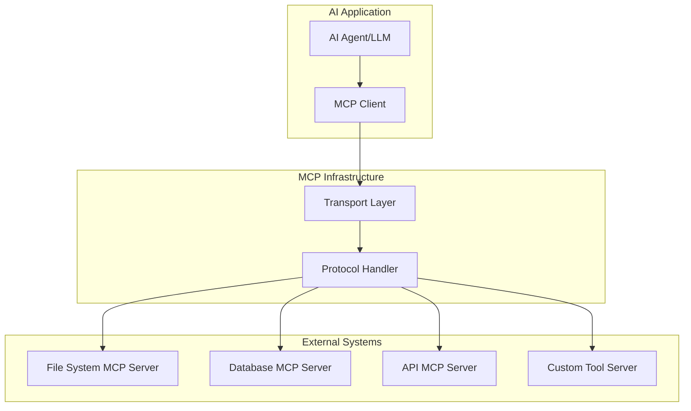

export const metadata = {
  title: "MCP Servers: Model Context Protocol Implementation",
  date: "2024-12-01",
  excerpt: "Master the Model Context Protocol (MCP) for building extensible AI applications. Learn to create, deploy, and integrate MCP servers for enhanced AI agent capabilities.",
  author: "Abstract Algorithms",
  tags: ["mcp", "model-context-protocol", "ai-agents", "extensibility", "llm-integration", "ai-architecture"],
  coverImage: "./assets/part-12.png",
  series: {
    name: "GenAI Mastery",
    order: 12,
    total: 12,
    prev: "/posts/genai-mastery-series/part-11",
    next: null
  }
}

# MCP Servers: Model Context Protocol Implementation

Welcome to the final part of our GenAI Mastery series! In this comprehensive guide, we'll explore the Model Context Protocol (MCP), a revolutionary approach to extending AI capabilities through standardized server integrations.

## What is the Model Context Protocol (MCP)?

The Model Context Protocol is an open standard designed to enable seamless integration between AI applications and external data sources, tools, and services. Think of MCP as a universal adapter that allows AI agents to interact with virtually any system in a standardized way.

### Key Benefits of MCP

- **Standardization**: Unified interface for AI-external system interactions
- **Extensibility**: Easy addition of new capabilities without modifying core AI systems
- **Security**: Controlled access to external resources with proper authorization
- **Scalability**: Efficient handling of multiple concurrent AI requests
- **Interoperability**: Cross-platform compatibility and vendor-neutral design

## Core MCP Concepts

### 1. MCP Architecture Overview



### 2. Protocol Components

**Resources**: Information sources that can be read by AI agents
**Tools**: Executable functions that AI agents can invoke
**Prompts**: Template-based interaction patterns
**Sampling**: Structured data retrieval mechanisms

## Building Your First MCP Server

### Setting Up the Development Environment

First, let's set up a basic MCP server using TypeScript:

```bash
# Create a new MCP server project
mkdir my-mcp-server
cd my-mcp-server
npm init -y

# Install MCP SDK and dependencies
npm install @modelcontextprotocol/sdk
npm install -D typescript @types/node ts-node
```

### Basic MCP Server Implementation

```typescript
// src/server.ts
import { Server } from '@modelcontextprotocol/sdk/server/index.js';
import { StdioServerTransport } from '@modelcontextprotocol/sdk/server/stdio.js';
import {
  CallToolRequestSchema,
  ListToolsRequestSchema,
  ListResourcesRequestSchema,
  ReadResourceRequestSchema,
} from '@modelcontextprotocol/sdk/types.js';

class MyMCPServer {
  private server: Server;

  constructor() {
    this.server = new Server(
      {
        name: 'my-mcp-server',
        version: '1.0.0',
      },
      {
        capabilities: {
          resources: {},
          tools: {},
        },
      }
    );

    this.setupHandlers();
  }

  private setupHandlers() {
    // Tool listing handler
    this.server.setRequestHandler(ListToolsRequestSchema, async () => {
      return {
        tools: [
          {
            name: 'calculate',
            description: 'Perform mathematical calculations',
            inputSchema: {
              type: 'object',
              properties: {
                expression: {
                  type: 'string',
                  description: 'Mathematical expression to evaluate'
                }
              },
              required: ['expression']
            }
          },
          {
            name: 'file_search',
            description: 'Search for files in the current directory',
            inputSchema: {
              type: 'object',
              properties: {
                pattern: {
                  type: 'string',
                  description: 'File search pattern (glob syntax)'
                }
              },
              required: ['pattern']
            }
          }
        ]
      };
    });

    // Tool execution handler
    this.server.setRequestHandler(CallToolRequestSchema, async (request) => {
      const { name, arguments: args } = request.params;

      switch (name) {
        case 'calculate':
          return this.handleCalculate(args.expression);
        case 'file_search':
          return this.handleFileSearch(args.pattern);
        default:
          throw new Error(`Unknown tool: ${name}`);
      }
    });

    // Resource listing handler
    this.server.setRequestHandler(ListResourcesRequestSchema, async () => {
      return {
        resources: [
          {
            uri: 'file://system-info',
            name: 'System Information',
            description: 'Current system information and stats',
            mimeType: 'application/json'
          }
        ]
      };
    });

    // Resource reading handler
    this.server.setRequestHandler(ReadResourceRequestSchema, async (request) => {
      const { uri } = request.params;

      if (uri === 'file://system-info') {
        return {
          contents: [
            {
              uri,
              mimeType: 'application/json',
              text: JSON.stringify({
                platform: process.platform,
                nodeVersion: process.version,
                uptime: process.uptime(),
                memory: process.memoryUsage()
              }, null, 2)
            }
          ]
        };
      }

      throw new Error(`Unknown resource: ${uri}`);
    });
  }

  private async handleCalculate(expression: string) {
    try {
      // Simple safe evaluation (in production, use a proper math parser)
      const result = Function(`"use strict"; return (${expression})`)();
      return {
        content: [
          {
            type: 'text',
            text: `Result: ${result}`
          }
        ]
      };
    } catch (error) {
      return {
        content: [
          {
            type: 'text',
            text: `Error: ${error.message}`
          }
        ],
        isError: true
      };
    }
  }

  private async handleFileSearch(pattern: string) {
    const glob = await import('glob');
    try {
      const files = await glob.glob(pattern);
      return {
        content: [
          {
            type: 'text',
            text: `Found ${files.length} files:\n${files.join('\n')}`
          }
        ]
      };
    } catch (error) {
      return {
        content: [
          {
            type: 'text',
            text: `Error searching files: ${error.message}`
          }
        ],
        isError: true
      };
    }
  }

  async start() {
    const transport = new StdioServerTransport();
    await this.server.connect(transport);
    console.error('MCP Server started successfully');
  }
}

// Start the server
const server = new MyMCPServer();
server.start().catch(console.error);
```

## Advanced MCP Server Patterns

### 1. Database Integration MCP Server

```typescript
// src/database-server.ts
import { Pool } from 'pg';
import { Server } from '@modelcontextprotocol/sdk/server/index.js';

class DatabaseMCPServer {
  private pool: Pool;
  private server: Server;

  constructor(connectionString: string) {
    this.pool = new Pool({ connectionString });
    this.server = new Server(
      { name: 'database-mcp-server', version: '1.0.0' },
      { capabilities: { tools: {} } }
    );
    
    this.setupHandlers();
  }

  private setupHandlers() {
    this.server.setRequestHandler(ListToolsRequestSchema, async () => {
      return {
        tools: [
          {
            name: 'query_database',
            description: 'Execute SQL queries on the database',
            inputSchema: {
              type: 'object',
              properties: {
                query: { type: 'string', description: 'SQL query to execute' },
                params: { 
                  type: 'array', 
                  description: 'Query parameters',
                  items: { type: 'string' }
                }
              },
              required: ['query']
            }
          },
          {
            name: 'get_schema',
            description: 'Get database schema information',
            inputSchema: {
              type: 'object',
              properties: {
                table: { 
                  type: 'string', 
                  description: 'Specific table name (optional)' 
                }
              }
            }
          }
        ]
      };
    });

    this.server.setRequestHandler(CallToolRequestSchema, async (request) => {
      const { name, arguments: args } = request.params;

      switch (name) {
        case 'query_database':
          return this.executeQuery(args.query, args.params || []);
        case 'get_schema':
          return this.getSchema(args.table);
        default:
          throw new Error(`Unknown tool: ${name}`);
      }
    });
  }

  private async executeQuery(query: string, params: string[]) {
    try {
      const result = await this.pool.query(query, params);
      return {
        content: [
          {
            type: 'text',
            text: JSON.stringify({
              rows: result.rows,
              rowCount: result.rowCount,
              fields: result.fields.map(f => ({ name: f.name, type: f.dataTypeID }))
            }, null, 2)
          }
        ]
      };
    } catch (error) {
      return {
        content: [{ type: 'text', text: `Database error: ${error.message}` }],
        isError: true
      };
    }
  }

  private async getSchema(tableName?: string) {
    try {
      const query = tableName 
        ? `SELECT column_name, data_type, is_nullable 
           FROM information_schema.columns 
           WHERE table_name = $1`
        : `SELECT table_name, table_type 
           FROM information_schema.tables 
           WHERE table_schema = 'public'`;
      
      const params = tableName ? [tableName] : [];
      const result = await this.pool.query(query, params);
      
      return {
        content: [
          {
            type: 'text',
            text: JSON.stringify(result.rows, null, 2)
          }
        ]
      };
    } catch (error) {
      return {
        content: [{ type: 'text', text: `Schema error: ${error.message}` }],
        isError: true
      };
    }
  }
}
```

### 2. API Integration MCP Server

```typescript
// src/api-server.ts
class APIMCPServer {
  private server: Server;
  private apiKey: string;

  constructor(apiKey: string) {
    this.apiKey = apiKey;
    this.server = new Server(
      { name: 'api-mcp-server', version: '1.0.0' },
      { capabilities: { tools: {}, resources: {} } }
    );
    
    this.setupHandlers();
  }

  private setupHandlers() {
    this.server.setRequestHandler(ListToolsRequestSchema, async () => {
      return {
        tools: [
          {
            name: 'fetch_weather',
            description: 'Get current weather for a location',
            inputSchema: {
              type: 'object',
              properties: {
                location: { type: 'string', description: 'City name or coordinates' }
              },
              required: ['location']
            }
          },
          {
            name: 'send_email',
            description: 'Send an email through the API',
            inputSchema: {
              type: 'object',
              properties: {
                to: { type: 'string', description: 'Recipient email' },
                subject: { type: 'string', description: 'Email subject' },
                body: { type: 'string', description: 'Email body' }
              },
              required: ['to', 'subject', 'body']
            }
          }
        ]
      };
    });

    this.server.setRequestHandler(CallToolRequestSchema, async (request) => {
      const { name, arguments: args } = request.params;

      switch (name) {
        case 'fetch_weather':
          return this.fetchWeather(args.location);
        case 'send_email':
          return this.sendEmail(args.to, args.subject, args.body);
        default:
          throw new Error(`Unknown tool: ${name}`);
      }
    });
  }

  private async fetchWeather(location: string) {
    try {
      const response = await fetch(
        `https://api.openweathermap.org/data/2.5/weather?q=${location}&appid=${this.apiKey}&units=metric`
      );
      const data = await response.json();
      
      return {
        content: [
          {
            type: 'text',
            text: JSON.stringify({
              location: data.name,
              temperature: data.main.temp,
              description: data.weather[0].description,
              humidity: data.main.humidity,
              windSpeed: data.wind.speed
            }, null, 2)
          }
        ]
      };
    } catch (error) {
      return {
        content: [{ type: 'text', text: `Weather API error: ${error.message}` }],
        isError: true
      };
    }
  }

  private async sendEmail(to: string, subject: string, body: string) {
    try {
      // Simulate email sending (replace with actual email service)
      const emailData = {
        to,
        subject,
        body,
        timestamp: new Date().toISOString(),
        status: 'sent'
      };
      
      return {
        content: [
          {
            type: 'text',
            text: `Email sent successfully: ${JSON.stringify(emailData, null, 2)}`
          }
        ]
      };
    } catch (error) {
      return {
        content: [{ type: 'text', text: `Email error: ${error.message}` }],
        isError: true
      };
    }
  }
}
```

## MCP Client Integration

### Connecting to MCP Servers

```typescript
// src/client.ts
import { Client } from '@modelcontextprotocol/sdk/client/index.js';
import { StdioClientTransport } from '@modelcontextprotocol/sdk/client/stdio.js';

class MCPClient {
  private clients: Map<string, Client> = new Map();

  async connectToServer(serverName: string, command: string, args: string[]) {
    const transport = new StdioClientTransport({
      command,
      args
    });

    const client = new Client(
      { name: 'mcp-client', version: '1.0.0' },
      { capabilities: {} }
    );

    await client.connect(transport);
    this.clients.set(serverName, client);
    
    console.log(`Connected to MCP server: ${serverName}`);
    return client;
  }

  async listTools(serverName: string) {
    const client = this.clients.get(serverName);
    if (!client) throw new Error(`Server ${serverName} not connected`);

    const response = await client.request(
      { method: 'tools/list' },
      ListToolsRequestSchema
    );
    
    return response.tools;
  }

  async callTool(serverName: string, toolName: string, args: any) {
    const client = this.clients.get(serverName);
    if (!client) throw new Error(`Server ${serverName} not connected`);

    const response = await client.request(
      {
        method: 'tools/call',
        params: {
          name: toolName,
          arguments: args
        }
      },
      CallToolRequestSchema
    );
    
    return response;
  }

  async listResources(serverName: string) {
    const client = this.clients.get(serverName);
    if (!client) throw new Error(`Server ${serverName} not connected`);

    const response = await client.request(
      { method: 'resources/list' },
      ListResourcesRequestSchema
    );
    
    return response.resources;
  }

  async readResource(serverName: string, uri: string) {
    const client = this.clients.get(serverName);
    if (!client) throw new Error(`Server ${serverName} not connected`);

    const response = await client.request(
      {
        method: 'resources/read',
        params: { uri }
      },
      ReadResourceRequestSchema
    );
    
    return response.contents;
  }
}

// Usage example
async function demonstrateMCPClient() {
  const client = new MCPClient();
  
  // Connect to our custom MCP server
  await client.connectToServer(
    'my-server', 
    'node', 
    ['dist/server.js']
  );
  
  // List available tools
  const tools = await client.listTools('my-server');
  console.log('Available tools:', tools);
  
  // Use the calculator tool
  const calcResult = await client.callTool(
    'my-server', 
    'calculate', 
    { expression: '2 + 2 * 3' }
  );
  console.log('Calculation result:', calcResult);
  
  // Search for files
  const fileResult = await client.callTool(
    'my-server', 
    'file_search', 
    { pattern: '*.ts' }
  );
  console.log('File search result:', fileResult);
}
```

## Production Deployment Strategies

### 1. Docker Containerization

```dockerfile
# Dockerfile
FROM node:18-alpine

WORKDIR /app

# Copy package files
COPY package*.json ./
RUN npm ci --only=production

# Copy source code
COPY dist/ ./dist/

# Create non-root user
RUN addgroup -g 1001 -S mcpuser && \
    adduser -S mcpuser -u 1001

USER mcpuser

EXPOSE 3000

CMD ["node", "dist/server.js"]
```

### 2. Kubernetes Deployment

```yaml
# k8s-deployment.yaml
apiVersion: apps/v1
kind: Deployment
metadata:
  name: mcp-server
spec:
  replicas: 3
  selector:
    matchLabels:
      app: mcp-server
  template:
    metadata:
      labels:
        app: mcp-server
    spec:
      containers:
      - name: mcp-server
        image: your-registry/mcp-server:latest
        ports:
        - containerPort: 3000
        env:
        - name: NODE_ENV
          value: "production"
        - name: DATABASE_URL
          valueFrom:
            secretKeyRef:
              name: mcp-secrets
              key: database-url
        resources:
          limits:
            memory: "512Mi"
            cpu: "500m"
          requests:
            memory: "256Mi"
            cpu: "250m"
---
apiVersion: v1
kind: Service
metadata:
  name: mcp-server-service
spec:
  selector:
    app: mcp-server
  ports:
  - protocol: TCP
    port: 80
    targetPort: 3000
  type: LoadBalancer
```

### 3. Monitoring and Observability

```typescript
// src/monitoring.ts
import { Server } from '@modelcontextprotocol/sdk/server/index.js';
import { createPrometheusMetrics } from './metrics.js';

class MonitoredMCPServer {
  private server: Server;
  private metrics: any;

  constructor() {
    this.metrics = createPrometheusMetrics();
    this.server = new Server(
      { name: 'monitored-mcp-server', version: '1.0.0' },
      { capabilities: { tools: {} } }
    );
    
    this.setupMiddleware();
    this.setupHandlers();
  }

  private setupMiddleware() {
    // Request counting middleware
    this.server.setRequestHandler = ((originalMethod) => {
      return (schema: any, handler: any) => {
        const wrappedHandler = async (request: any) => {
          const startTime = Date.now();
          this.metrics.requestsTotal.inc({ method: request.method });
          
          try {
            const result = await handler(request);
            this.metrics.requestDuration.observe(
              { method: request.method, status: 'success' },
              Date.now() - startTime
            );
            return result;
          } catch (error) {
            this.metrics.requestDuration.observe(
              { method: request.method, status: 'error' },
              Date.now() - startTime
            );
            this.metrics.errorsTotal.inc({ method: request.method });
            throw error;
          }
        };
        
        return originalMethod.call(this.server, schema, wrappedHandler);
      };
    })(this.server.setRequestHandler.bind(this.server));
  }
}
```

## Security Best Practices

### 1. Authentication and Authorization

```typescript
// src/auth.ts
import jwt from 'jsonwebtoken';
import { Server } from '@modelcontextprotocol/sdk/server/index.js';

class SecureMCPServer {
  private server: Server;
  private jwtSecret: string;

  constructor(jwtSecret: string) {
    this.jwtSecret = jwtSecret;
    this.server = new Server(
      { name: 'secure-mcp-server', version: '1.0.0' },
      { capabilities: { tools: {} } }
    );
    
    this.setupAuthMiddleware();
  }

  private setupAuthMiddleware() {
    // Add authentication to all requests
    const originalSetRequestHandler = this.server.setRequestHandler.bind(this.server);
    
    this.server.setRequestHandler = (schema: any, handler: any) => {
      const authenticatedHandler = async (request: any) => {
        // Extract token from request metadata
        const token = request.meta?.authorization?.replace('Bearer ', '');
        
        if (!token) {
          throw new Error('Authentication token required');
        }

        try {
          const decoded = jwt.verify(token, this.jwtSecret) as any;
          request.user = decoded;
          
          // Check permissions for specific tools
          if (request.method === 'tools/call') {
            this.checkToolPermissions(decoded, request.params.name);
          }
          
          return await handler(request);
        } catch (error) {
          throw new Error('Invalid authentication token');
        }
      };
      
      return originalSetRequestHandler(schema, authenticatedHandler);
    };
  }

  private checkToolPermissions(user: any, toolName: string) {
    const requiredPermissions = {
      'database_query': ['db:read'],
      'file_write': ['fs:write'],
      'send_email': ['email:send']
    };

    const required = requiredPermissions[toolName] || [];
    const userPermissions = user.permissions || [];
    
    const hasPermission = required.every(perm => 
      userPermissions.includes(perm)
    );
    
    if (!hasPermission) {
      throw new Error(`Insufficient permissions for tool: ${toolName}`);
    }
  }
}
```

### 2. Input Validation and Sanitization

```typescript
// src/validation.ts
import Joi from 'joi';

class ValidatedMCPServer {
  private server: Server;
  private schemas: Map<string, Joi.Schema> = new Map();

  constructor() {
    this.server = new Server(
      { name: 'validated-mcp-server', version: '1.0.0' },
      { capabilities: { tools: {} } }
    );
    
    this.setupValidationSchemas();
    this.setupValidatedHandlers();
  }

  private setupValidationSchemas() {
    // SQL query validation
    this.schemas.set('database_query', Joi.object({
      query: Joi.string().pattern(/^(SELECT|INSERT|UPDATE|DELETE)/i).required(),
      params: Joi.array().items(Joi.alternatives(
        Joi.string().max(1000),
        Joi.number(),
        Joi.boolean()
      )).max(50)
    }));

    // File operation validation
    this.schemas.set('file_operation', Joi.object({
      path: Joi.string().pattern(/^[a-zA-Z0-9\/\._-]+$/).required(),
      content: Joi.string().max(10000000) // 10MB limit
    }));

    // Email validation
    this.schemas.set('send_email', Joi.object({
      to: Joi.string().email().required(),
      subject: Joi.string().max(200).required(),
      body: Joi.string().max(100000).required()
    }));
  }

  private validateInput(toolName: string, input: any) {
    const schema = this.schemas.get(toolName);
    if (!schema) return input;

    const { error, value } = schema.validate(input);
    if (error) {
      throw new Error(`Validation error: ${error.details[0].message}`);
    }
    
    return value;
  }

  private setupValidatedHandlers() {
    this.server.setRequestHandler(CallToolRequestSchema, async (request) => {
      const { name, arguments: args } = request.params;
      
      // Validate input arguments
      const validatedArgs = this.validateInput(name, args);
      
      // Sanitize strings to prevent injection attacks
      const sanitizedArgs = this.sanitizeInput(validatedArgs);
      
      // Proceed with tool execution
      return this.executeTool(name, sanitizedArgs);
    });
  }

  private sanitizeInput(input: any): any {
    if (typeof input === 'string') {
      // Remove potentially dangerous characters
      return input.replace(/[<>\"'%;()&+]/g, '');
    }
    
    if (Array.isArray(input)) {
      return input.map(item => this.sanitizeInput(item));
    }
    
    if (typeof input === 'object' && input !== null) {
      const sanitized: any = {};
      for (const [key, value] of Object.entries(input)) {
        sanitized[key] = this.sanitizeInput(value);
      }
      return sanitized;
    }
    
    return input;
  }
}
```

## Testing MCP Servers

### Unit Testing

```typescript
// tests/server.test.ts
import { describe, it, expect, beforeEach } from 'vitest';
import { TestTransport } from '@modelcontextprotocol/sdk/testing.js';
import { MyMCPServer } from '../src/server.js';

describe('MCP Server Tests', () => {
  let server: MyMCPServer;
  let transport: TestTransport;

  beforeEach(async () => {
    server = new MyMCPServer();
    transport = new TestTransport();
    await server.connect(transport);
  });

  it('should list available tools', async () => {
    const response = await transport.request({
      method: 'tools/list'
    });

    expect(response.tools).toHaveLength(2);
    expect(response.tools[0].name).toBe('calculate');
    expect(response.tools[1].name).toBe('file_search');
  });

  it('should perform calculations correctly', async () => {
    const response = await transport.request({
      method: 'tools/call',
      params: {
        name: 'calculate',
        arguments: { expression: '2 + 2' }
      }
    });

    expect(response.content[0].text).toBe('Result: 4');
  });

  it('should handle calculation errors gracefully', async () => {
    const response = await transport.request({
      method: 'tools/call',
      params: {
        name: 'calculate',
        arguments: { expression: 'invalid_expression' }
      }
    });

    expect(response.isError).toBe(true);
    expect(response.content[0].text).toContain('Error:');
  });
});
```

### Integration Testing

```typescript
// tests/integration.test.ts
import { spawn } from 'child_process';
import { Client } from '@modelcontextprotocol/sdk/client/index.js';
import { StdioClientTransport } from '@modelcontextprotocol/sdk/client/stdio.js';

describe('MCP Integration Tests', () => {
  let client: Client;
  let serverProcess: any;

  beforeAll(async () => {
    // Start the MCP server
    serverProcess = spawn('node', ['dist/server.js'], {
      stdio: ['pipe', 'pipe', 'pipe']
    });

    // Create client and connect
    const transport = new StdioClientTransport({
      command: 'node',
      args: ['dist/server.js']
    });

    client = new Client(
      { name: 'test-client', version: '1.0.0' },
      { capabilities: {} }
    );

    await client.connect(transport);
  });

  afterAll(async () => {
    if (serverProcess) {
      serverProcess.kill();
    }
  });

  it('should connect and list tools successfully', async () => {
    const response = await client.request(
      { method: 'tools/list' },
      ListToolsRequestSchema
    );

    expect(response.tools).toBeDefined();
    expect(response.tools.length).toBeGreaterThan(0);
  });
});
```

## Performance Optimization

### 1. Caching Strategies

```typescript
// src/cache.ts
import { LRUCache } from 'lru-cache';

class CachedMCPServer {
  private cache: LRUCache<string, any>;
  private server: Server;

  constructor() {
    this.cache = new LRUCache({
      max: 1000,
      ttl: 1000 * 60 * 5 // 5 minutes
    });
    
    this.server = new Server(
      { name: 'cached-mcp-server', version: '1.0.0' },
      { capabilities: { tools: {} } }
    );
  }

  private async executeWithCache(
    cacheKey: string, 
    operation: () => Promise<any>,
    ttl?: number
  ) {
    // Check cache first
    const cached = this.cache.get(cacheKey);
    if (cached) {
      return {
        ...cached,
        _cached: true
      };
    }

    // Execute operation
    const result = await operation();
    
    // Cache the result
    this.cache.set(cacheKey, result, { ttl });
    
    return result;
  }

  private async handleDatabaseQuery(query: string, params: any[]) {
    const cacheKey = `query:${query}:${JSON.stringify(params)}`;
    
    return this.executeWithCache(cacheKey, async () => {
      // Execute actual database query
      return this.pool.query(query, params);
    }, 1000 * 60 * 2); // 2 minutes TTL for DB queries
  }
}
```

### 2. Connection Pooling

```typescript
// src/pool.ts
class PooledMCPServer {
  private connectionPool: Map<string, any> = new Map();
  private maxConnections = 10;
  private currentConnections = 0;

  async getConnection(type: string, config: any) {
    const poolKey = `${type}:${JSON.stringify(config)}`;
    
    if (this.connectionPool.has(poolKey)) {
      return this.connectionPool.get(poolKey);
    }

    if (this.currentConnections >= this.maxConnections) {
      // Wait for available connection or implement queue
      await this.waitForAvailableConnection();
    }

    const connection = await this.createConnection(type, config);
    this.connectionPool.set(poolKey, connection);
    this.currentConnections++;
    
    return connection;
  }

  private async createConnection(type: string, config: any) {
    switch (type) {
      case 'database':
        return new Pool(config);
      case 'redis':
        return createRedisClient(config);
      default:
        throw new Error(`Unknown connection type: ${type}`);
    }
  }
}
```

## Best Practices and Guidelines

### 1. Error Handling

```typescript
class RobustMCPServer {
  private setupErrorHandling() {
    // Global error handler
    process.on('uncaughtException', (error) => {
      console.error('Uncaught Exception:', error);
      // Log to monitoring system
      this.logError(error);
      // Graceful shutdown
      this.gracefulShutdown();
    });

    // Async error handler
    process.on('unhandledRejection', (reason, promise) => {
      console.error('Unhandled Rejection at:', promise, 'reason:', reason);
      this.logError(reason);
    });
  }

  private async executeToolSafely(toolName: string, args: any) {
    try {
      return await this.executeTool(toolName, args);
    } catch (error) {
      // Log error with context
      this.logError(error, { toolName, args });
      
      // Return user-friendly error
      return {
        content: [{
          type: 'text',
          text: 'An error occurred while executing the tool. Please try again.'
        }],
        isError: true
      };
    }
  }
}
```

### 2. Logging and Observability

```typescript
// src/logger.ts
import winston from 'winston';

const logger = winston.createLogger({
  level: 'info',
  format: winston.format.combine(
    winston.format.timestamp(),
    winston.format.errors({ stack: true }),
    winston.format.json()
  ),
  transports: [
    new winston.transports.File({ filename: 'error.log', level: 'error' }),
    new winston.transports.File({ filename: 'combined.log' }),
    new winston.transports.Console({
      format: winston.format.simple()
    })
  ]
});

class LoggedMCPServer {
  private logRequest(method: string, params: any, duration: number) {
    logger.info('MCP Request', {
      method,
      params: this.sanitizeParams(params),
      duration,
      timestamp: new Date().toISOString()
    });
  }

  private logError(error: any, context?: any) {
    logger.error('MCP Error', {
      error: error.message,
      stack: error.stack,
      context,
      timestamp: new Date().toISOString()
    });
  }
}
```

## Future of MCP

### Emerging Patterns

1. **Multi-Modal MCP Servers**: Handling text, images, audio, and video
2. **Federated MCP Networks**: Distributed server architectures
3. **AI-to-AI Communication**: MCP servers as intermediaries between AI systems
4. **Edge Computing Integration**: MCP servers at the network edge
5. **Blockchain Integration**: Decentralized MCP server registries

### Next Steps

1. **Explore MCP Ecosystem**: Discover existing MCP servers and tools
2. **Build Custom Servers**: Create domain-specific MCP implementations
3. **Contribute to Standards**: Participate in MCP specification development
4. **Performance Optimization**: Implement advanced caching and optimization strategies
5. **Security Hardening**: Develop robust security practices for production deployments

## Conclusion

The Model Context Protocol represents a significant advancement in AI extensibility and integration. By mastering MCP server development, you can create powerful, standardized interfaces that enable AI systems to interact with virtually any external service or data source.

Key takeaways from this comprehensive guide:

- **Standardization**: MCP provides a unified approach to AI-external system integration
- **Flexibility**: Servers can be customized for any domain or use case
- **Security**: Proper authentication, authorization, and validation are crucial
- **Performance**: Caching, pooling, and monitoring ensure production readiness
- **Testing**: Comprehensive testing strategies ensure reliability

As you implement MCP servers in your projects, remember to focus on security, performance, and maintainability. The MCP ecosystem is rapidly evolving, offering exciting opportunities for innovation in AI application development.

---

*This concludes our 12-part GenAI Mastery series. You now have comprehensive knowledge spanning from AI fundamentals to advanced topics like MCP server implementation. Continue exploring, building, and pushing the boundaries of what's possible with modern AI technologies.*
