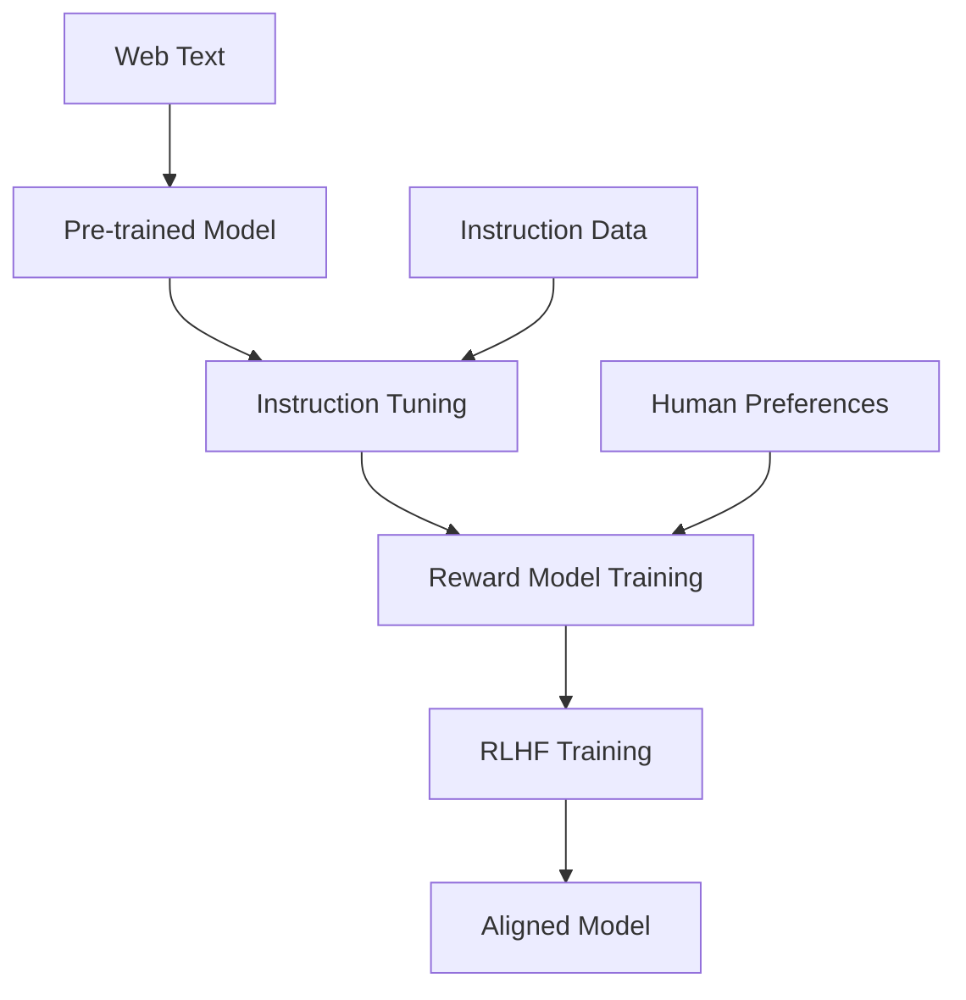

export const metadata = {
  title: "Large Language Models: GPT, BERT, and Beyond",
  date: "2024-12-01",
  excerpt: "Explore Large Language Models that power ChatGPT, Claude, and other breakthrough AI systems. Learn about GPT, BERT, and the latest developments in LLM technology.",
  author: "Abstract Algorithms",
  tags: ["llm", "gpt", "bert", "large-language-models", "transformers", "nlp", "generative-ai"],
  coverImage: "./assets/part-4.png",
  series: {
    name: "GenAI Mastery",
    order: 4,
    total: 12,
    prev: "/posts/genai-mastery-series/part-3",
    next: "/posts/genai-mastery-series/part-5"
  }
}

# Part 4: Large Language Models: GPT, BERT, and Beyond

Welcome to the heart of modern AI! In this part, we'll explore Large Language Models (LLMs) - the powerhouses behind ChatGPT, Claude, and other breakthrough AI systems that have transformed how we interact with technology.


*Comparison of major LLM architectures: GPT, BERT, T5, and more*

## 🎯 Learning Objectives

By the end of this part, you'll understand:
- What makes a language model "large" and why size matters
- Key LLM architectures and their differences
- Training methodologies for modern LLMs
- Capabilities and limitations of current models
- The role of scaling laws in AI development

## 🧠 What Are Large Language Models?

Large Language Models are neural networks with billions or trillions of parameters, trained on vast amounts of text data to understand and generate human-like language.

### Key Characteristics

**Scale**: Modern LLMs have:
- **Parameters**: 7B to 1.7T+ parameters
- **Training Data**: Hundreds of billions to trillions of tokens
- **Compute**: Thousands of GPUs for months

**Capabilities**:
- Text generation and completion
- Language understanding and reasoning
- Code generation and debugging
- Translation and summarization
- Multi-step problem solving

## 🏗️ Major LLM Architectures


*Evolution and relationships between major LLM families*

### 1. GPT Series (Decoder-Only)

**GPT-1 (2018)**
- 117M parameters
- Demonstrated unsupervised pre-training effectiveness

**GPT-2 (2019)**
- 1.5B parameters
- Initially withheld due to safety concerns
- Showed emergent abilities at scale

**GPT-3 (2020)**
- 175B parameters
- Few-shot learning breakthrough
- Foundation for ChatGPT

**GPT-4 (2023)**
- Estimated 1.7T+ parameters
- Multimodal capabilities (text + images)
- Significant reasoning improvements

#### GPT Architecture Deep Dive

```python
# Simplified GPT architecture
class GPTBlock(nn.Module):
    def __init__(self, config):
        super().__init__()
        self.ln1 = nn.LayerNorm(config.hidden_size)
        self.attn = CausalSelfAttention(config)
        self.ln2 = nn.LayerNorm(config.hidden_size)
        self.mlp = MLP(config)
        
    def forward(self, x):
        # Pre-norm architecture
        x = x + self.attn(self.ln1(x))
        x = x + self.mlp(self.ln2(x))
        return x

class GPT(nn.Module):
    def __init__(self, config):
        super().__init__()
        self.embed = nn.Embedding(config.vocab_size, config.hidden_size)
        self.pos_embed = nn.Embedding(config.max_seq_len, config.hidden_size)
        self.blocks = nn.ModuleList([GPTBlock(config) for _ in range(config.num_layers)])
        self.ln_f = nn.LayerNorm(config.hidden_size)
        self.head = nn.Linear(config.hidden_size, config.vocab_size)
```

### 2. BERT Series (Encoder-Only)

**BERT (2018)**
- Bidirectional Encoder Representations from Transformers
- Masked Language Modeling (MLM) training
- Excellent for understanding tasks

**Key Innovations**:
- **Bidirectional Context**: Sees both left and right context
- **Masked Language Modeling**: Predicts masked tokens
- **Next Sentence Prediction**: Understands sentence relationships

**RoBERTa (2019)**
- Optimized BERT training
- Removed Next Sentence Prediction
- Dynamic masking strategy

**DeBERTa (2020)**
- Disentangled attention mechanism
- Enhanced mask decoder
- State-of-the-art understanding performance

### 3. T5 (Encoder-Decoder)

**Text-to-Text Transfer Transformer**
- Everything as text generation
- Unified framework for all NLP tasks
- Strong performance across diverse tasks

```python
# T5 approach: everything as text-to-text
examples = {
    "translation": "translate English to German: The house is wonderful.",
    "summarization": "summarize: [long text]",
    "classification": "cola sentence: The course is jumping well.",
    "question_answering": "question: What is the capital of France? context: [text]"
}
```

## 🚀 Modern LLM Families

### Meta's LLaMA Series

**LLaMA (2023)**
- 7B, 13B, 30B, 65B parameters
- Open research license
- Efficient architecture design

**LLaMA 2 (2023)**
- Commercial license
- 7B, 13B, 70B parameters
- Chat variants with RLHF

**Code Llama (2023)**
- Specialized for code generation
- Based on LLaMA 2
- Multiple model sizes

### Anthropic's Claude

**Constitutional AI Approach**
- Claude 1, Claude 2, Claude 3 series
- Focus on helpfulness, harmlessness, honesty
- Long context windows (up to 200k tokens)

### Google's PaLM and Gemini

**PaLM (2022)**
- 540B parameters
- Pathways architecture
- Strong reasoning capabilities

**Gemini (2023)**
- Multimodal from the ground up
- Multiple sizes: Ultra, Pro, Nano
- Competitive with GPT-4

## 📊 Scaling Laws and Emergent Abilities


*Performance vs model size, data, and compute*

### Chinchilla Scaling Laws

Key findings from DeepMind's research:
- **Compute-Optimal Training**: Balance model size and training data
- **Data Requirements**: Need ~20 tokens per parameter for optimal training
- **Diminishing Returns**: Returns decrease but don't plateau

### Emergent Abilities

Capabilities that appear suddenly at certain scales:

**In-Context Learning**
- Few-shot learning without parameter updates
- Emerges around 13B parameters

**Chain-of-Thought Reasoning**
- Step-by-step problem solving
- Appears in models 100B+ parameters

**Instruction Following**
- Following complex, multi-step instructions
- Enhanced through instruction tuning

## 🎯 Training Methodologies

### Pre-training Phase

**Objective**: Learn general language understanding
- **Data**: Massive text corpora (web pages, books, articles)
- **Task**: Next token prediction
- **Duration**: Weeks to months on thousands of GPUs

```python
# Simplified pre-training loop
def pretrain_step(model, batch):
    inputs = batch['tokens'][:-1]  # Input sequence
    targets = batch['tokens'][1:]   # Shifted targets
    
    logits = model(inputs)
    loss = cross_entropy(logits, targets)
    
    return loss
```

### Instruction Tuning

**Objective**: Follow human instructions
- **Data**: Instruction-response pairs
- **Method**: Supervised fine-tuning
- **Examples**: "Translate this text", "Summarize this article"

### Reinforcement Learning from Human Feedback (RLHF)

**Objective**: Align with human preferences
- **Reward Model**: Learns human preferences
- **Policy Training**: Optimize for high reward
- **Safety**: Reduces harmful outputs



## 💡 Model Capabilities Comparison

| Model | Parameters | Context Length | Key Strengths |
|-------|-----------|----------------|---------------|
| GPT-4 | ~1.7T | 128k tokens | Reasoning, multimodal |
| Claude 3 Opus | Unknown | 200k tokens | Long context, safety |
| LLaMA 2 70B | 70B | 4k tokens | Open source, efficient |
| Gemini Ultra | Unknown | 32k tokens | Multimodal, math |

### Performance Benchmarks

**Language Understanding**
- GLUE, SuperGLUE benchmarks
- Reading comprehension tasks
- Common sense reasoning

**Code Generation**
- HumanEval coding benchmark
- CodeT5 evaluation
- Real-world programming tasks

**Math and Reasoning**
- GSM8K math word problems
- MATH competition problems
- Logical reasoning tasks

## 🔬 Model Analysis Techniques

### Probing and Interpretability

**Attention Visualization**
```python
# Visualize attention patterns
def visualize_attention(model, text, layer, head):
    tokens = tokenize(text)
    with torch.no_grad():
        outputs = model(tokens, output_attentions=True)
        attention = outputs.attentions[layer][0, head]
    
    plot_attention_heatmap(tokens, attention)
```

**Activation Patching**
- Identify which components matter for specific tasks
- Causal intervention techniques
- Understanding model behavior

### Model Editing

**Knowledge Editing**
- Update factual knowledge without retraining
- Techniques: ROME, MEMIT
- Applications: Fixing misinformation

## ⚠️ Limitations and Challenges

### Known Issues

**Hallucination**
- Generating false but plausible information
- Mitigation: Retrieval augmentation, fact-checking

**Bias and Fairness**
- Reflecting training data biases
- Demographic, cultural, and ideological biases

**Context Limitations**
- Fixed context windows
- Long-term memory challenges

**Reasoning Gaps**
- Struggles with complex logical reasoning
- Mathematical computation errors

### Safety Concerns

**Misuse Potential**
- Generating harmful content
- Misinformation and propaganda
- Privacy violations

**Alignment Challenges**
- Following unintended instructions
- Goal misalignment problems
- Specification gaming

## 🧪 Interactive Quiz

### Question 1: What is the main difference between GPT and BERT architectures?
A) GPT uses attention, BERT doesn't
B) GPT is decoder-only, BERT is encoder-only
C) GPT is smaller than BERT
D) GPT can't understand context

<details>
<summary>Click for answer</summary>

**Answer: B) GPT is decoder-only, BERT is encoder-only**

GPT uses a decoder-only architecture designed for autoregressive generation, while BERT uses an encoder-only architecture designed for bidirectional understanding tasks.
</details>

### Question 2: What training objective does BERT use?
A) Next token prediction
B) Masked Language Modeling
C) Translation tasks
D) Question answering

<details>
<summary>Click for answer</summary>

**Answer: B) Masked Language Modeling**

BERT's main training objective is Masked Language Modeling (MLM), where random tokens are masked and the model learns to predict them using bidirectional context.
</details>

### Question 3: At approximately what scale do emergent abilities like in-context learning appear?
A) 1B parameters
B) 13B parameters
C) 100B parameters
D) 1T parameters

<details>
<summary>Click for answer</summary>

**Answer: B) 13B parameters**

In-context learning abilities begin to emerge around 13B parameters, though they continue to improve with larger models.
</details>

## 🛠️ Hands-On Exercise

Let's explore a simple language model implementation:

```python
import torch
import torch.nn as nn
from transformers import GPT2LMHeadModel, GPT2Tokenizer

# Load a pre-trained model
model_name = "gpt2"
model = GPT2LMHeadModel.from_pretrained(model_name)
tokenizer = GPT2Tokenizer.from_pretrained(model_name)

def generate_text(prompt, max_length=100):
    # Tokenize input
    inputs = tokenizer.encode(prompt, return_tensors='pt')
    
    # Generate text
    with torch.no_grad():
        outputs = model.generate(
            inputs,
            max_length=max_length,
            num_return_sequences=1,
            pad_token_id=tokenizer.eos_token_id,
            do_sample=True,
            temperature=0.7
        )
    
    # Decode and return
    generated_text = tokenizer.decode(outputs[0], skip_special_tokens=True)
    return generated_text

# Try it out
prompt = "The future of artificial intelligence"
result = generate_text(prompt)
print(result)
```

## 🔗 What's Next?

In **Part 5**, we'll explore the art and science of **Prompt Engineering**, learning how to effectively communicate with large language models to get the best results for any task.

Topics we'll cover:
- Prompt design principles and best practices
- Few-shot learning and in-context examples
- Chain-of-thought prompting techniques
- Advanced prompting strategies (ReAct, ToT, etc.)
- Prompt optimization and evaluation

## 📚 Further Reading

**Research Papers:**
- "Language Models are Few-Shot Learners" (GPT-3 paper)
- "Training language models to follow instructions with human feedback" (InstructGPT)
- "Constitutional AI: Harmlessness from AI Feedback" (Claude)

**Technical Resources:**
- Hugging Face Transformers Library
- Papers with Code LLM leaderboards
- EleutherAI research and models

**Industry Analysis:**
- Epoch AI compute trends
- Foundation Model Index by Stanford HAI
- State of AI reports

---

*Continue with [Part 5: Prompt Engineering & Few-Shot Learning →](/posts/genai-mastery-series/part-5)*
