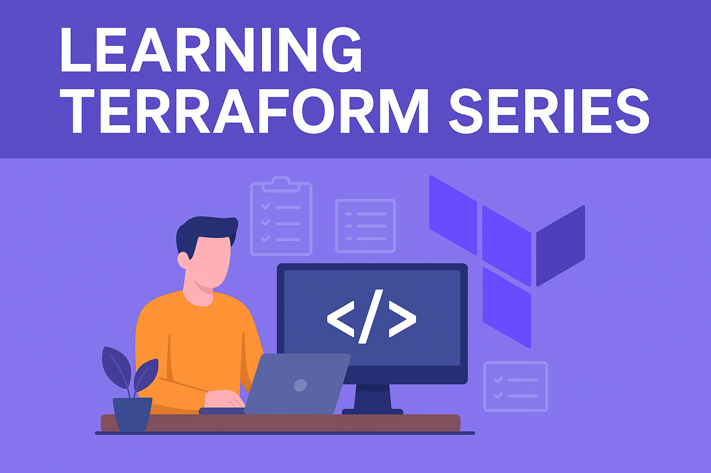

<TopSeriesNav 
  seriesName="Learning Terraform: Infrastructure as Code" 
  currentOrder={1} 
  total={5} 
  prev={null} 
  next="/posts/learning-terraform-series-part-2"
/>

Welcome to our comprehensive Terraform learning series. This is Part 1 of a 5-part series covering everything from getting started with Terraform to advanced features and best practices.



## Part 1: Getting Started with Terraform

Terraform is an open-source infrastructure as code software tool created by HashiCorp. It allows users to define and provision a datacenter infrastructure using a declarative configuration language.

### Installation

Begin by installing Terraform on your local machine. You can download the latest version from the official [Terraform website](https://www.terraform.io/downloads.html).

```bash
# Example for Linux
wget https://releases.hashicorp.com/terraform/0.14.7/terraform_0.14.7_linux_amd64.zip
unzip terraform_0.14.7_linux_amd64.zip
mv terraform /usr/local/bin/
```

### Your First Terraform Configuration

Create a simple Terraform configuration file (e.g., `main.tf`) to deploy an AWS S3 bucket:

```hcl
provider "aws" {
  region = "us-west-2"
}

resource "aws_s3_bucket" "example" {
  bucket = "my-terraform-bucket"
  acl    = "private"
}
```

### Initialize and Apply

Run the following commands to initialize your Terraform configuration and apply the changes:

```bash
terraform init
terraform plan
terraform apply
```

Now you have successfully deployed an S3 bucket using Terraform! This is just the beginning of our learning journey.

<TopSeriesNav 
  seriesName="Learning Terraform: Infrastructure as Code" 
  currentOrder={1} 
  total={5} 
  prev={null} 
  next="/posts/learning-terraform-series-part-2"
/>

---

**Next in series:** [Part 2: Language Essentials](/posts/learning-terraform-series-part-2)

---

*This article is part of the "Learning Terraform: Infrastructure as Code" series. Use the series navigation above to explore all parts.*
